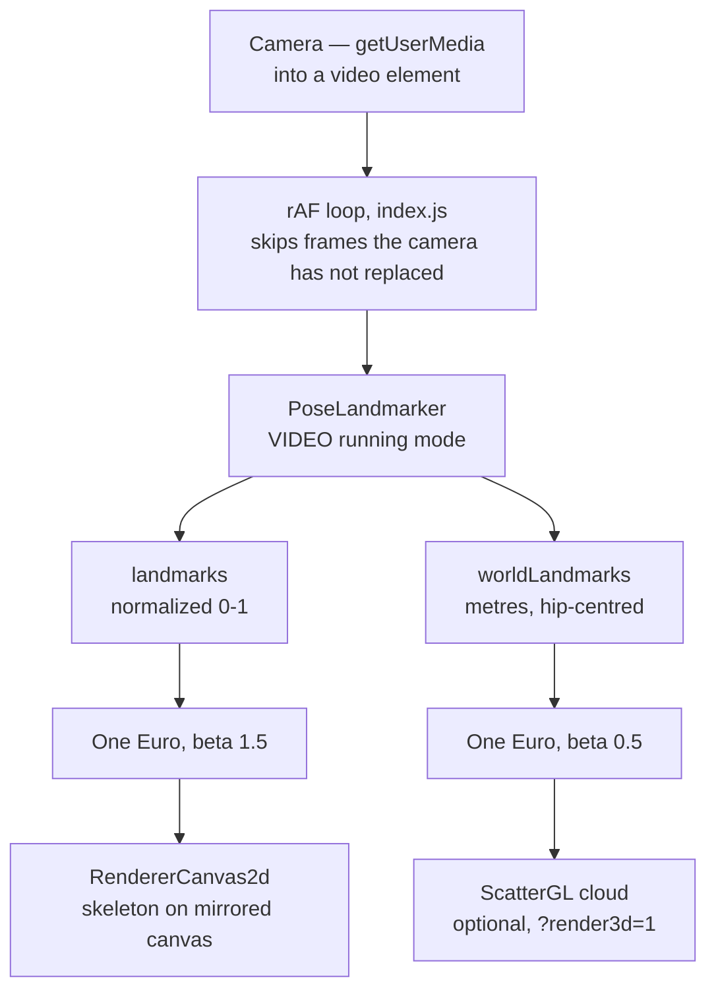
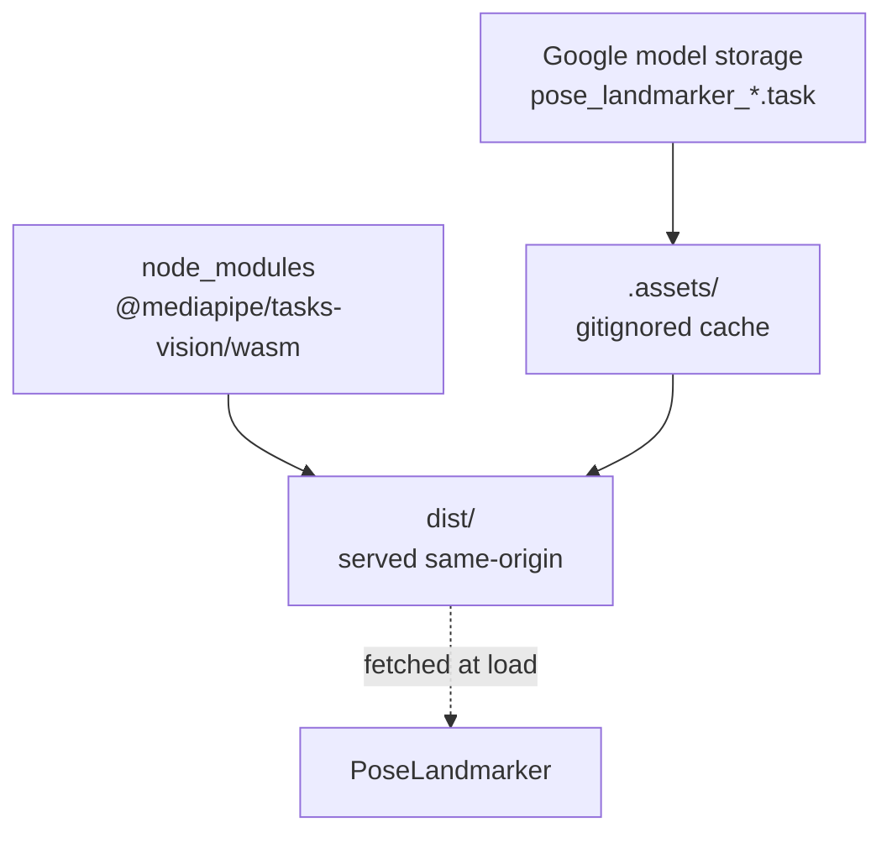

# RoboCoach 🤸

Real-time pose estimation in the browser, aimed at sport movement. Opens your
webcam, runs MediaPipe's BlazePose landmarker over each frame, and draws the
33-point skeleton back over the video — left side in green, right side in
orange, so limbs stay readable when they cross.

Everything runs client-side. The video never leaves the machine, and after the
first load the app fetches nothing from a third party.

## Running it

```sh
make build   # corepack enable && yarn install
make run     # stage assets, then serve on http://localhost:1234
```

The camera needs a secure context, so use `localhost` or HTTPS.

`make run` stages MediaPipe's Wasm runtime and model weights into `dist/` before
serving (see `scripts/fetch-assets.mjs`). Weights are cached in `.assets/`, so
only the first run needs the network.

## Architecture

One `requestAnimationFrame` loop drives everything. Each frame goes from the
webcam through MediaPipe's pose landmarker, gets smoothed, and lands on a
canvas. There is no backend and no application state beyond the filter history
the smoother carries between frames.

The detector emits two coordinate spaces from the same inference, and they are
used for different things. `landmarks` are normalized 0–1 and get scaled to
canvas pixels for the overlay; `worldLandmarks` are in metres, hip-centred, and
are the space to compute joint angles in. Each gets its own smoother, tuned
separately — speeds in metres are roughly 3x those in normalized units, so the
filter's speed coefficient differs.

MediaPipe fetches its Wasm runtime and model weights over HTTP at load time,
outside the bundler, so a build step stages both into `dist/` and the app serves
them from its own origin.



Both branches come out of a single inference; nothing is detected twice.

The two assets MediaPipe loads over HTTP are staged into `dist/` at build time,
so the running app is single-origin and needs no CDN:



### Files

| Path | Role |
| --- | --- |
| `src/index.js` | Bootstrap, the rAF loop, URL-param config. |
| `src/camera.js` | `getUserMedia` setup and stream sizing. |
| `src/params.js` | Config, asset paths, the 33-landmark topology. |
| `src/one_euro_filter.js` | The filter and the per-landmark smoother. |
| `src/renderer_canvas2d.js` | 2D skeleton drawing and the 3D point cloud. |
| `scripts/fetch-assets.mjs` | Stages the Wasm runtime and weights into `dist/`. |

## Options

Set via URL query string:

| Param | Values | Default | Effect |
| --- | --- | --- | --- |
| `model` | `lite`, `full`, `heavy` | `full` | Accuracy/speed tradeoff. `heavy` needs `make assets` first. |
| `render3d` | `1`, `0` | `0` | Rotatable 3D point cloud of the metric world landmarks. |
| `smoothing` | `1`, `0` | `1` | One Euro filter over the landmarks. Turn off to see how much it does. |

## Why this stack

Sport movement has to work from the side as well as head-on, and a 2D model
cannot do that well: side-on, the left and right limbs overlap and there is no
depth to tell them apart. MediaPipe's pose landmarker emits **33 landmarks with
3D world coordinates in metres**, including heels and toes, which is what makes
joint angles and left/right disambiguation possible from either angle.

Landmarks are smoothed with a [One Euro filter](https://gery.casiez.net/1euro/),
which adapts to speed — heavy smoothing when a position is held, almost none
when a limb is moving fast. On fast motion this matters more for stable joint
angles than the choice of model does.
